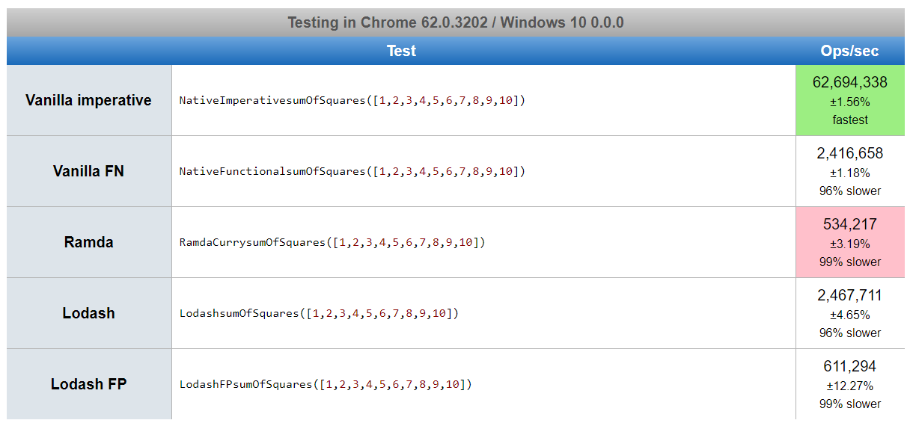
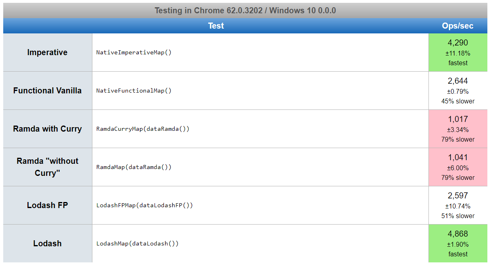
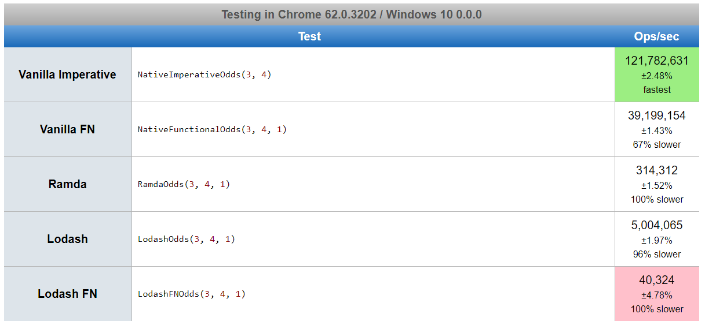
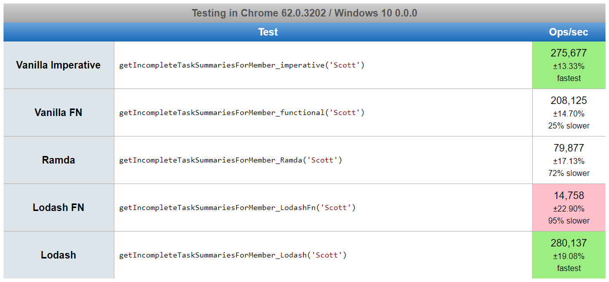
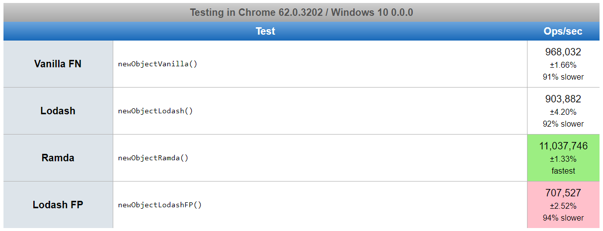

# Siempre es mejor Vanilla
<pre>
La idea en este repositorio no es ser fanático a Vanilla, se pretende demostrar que antes era necesario usar librerías que principalmente volvían nuestro código más legible y pudiesemos acceder a funciones sin que este se volviera espagueti. Ahora, al igual que todos los otros lenguajes de programación, JavaScript tiene sus nuevas versiones pero a diferencia de los demás no debemos actualizar el compilador, sino actualizar el Browser y la versión de NodeJS.

Lastimosamente aún hay muchos browsers que no se actualizan a los estandares de JavaScript ni habilitan las nuevas características de la web, por ello como programadores debemos de seguir transpilando nuestro código.
</pre>

En este pequeño repo se intentará demostrar que siempre es mejor **Vanilla** a través de tres elementos que se encontrarán a continuación, 1. performance, 2. legibilidad (o sintaxis) y 3. tamaño en la compilación con webpack, se pretende ser lo más objetivo posible, pero si usted como lector puede aportar a esta interesante discusión, no dude ni un segundo y envíe su aporte, ya sea como un _issue_ o por email. 

**¿Cómo se hará la evaluación?**
En la sección de performance se evaluarán una serie de funciones que procesarán algunos datos, de la manera en que se haría usando cada tecnología, así se establecerá cuál tiene una mayor velocidad de procesamiento, aunque es necesario dejar claro que en la última prueba no hubo una respuesta tan satisfactoria debido a que las pruebas variaban de respuesta por cada vez que se corría el test aunque en promedio es como se muestra en la imagen, no sé si porque las funciones son asíncronas, esto más adelante se ejecutará en otro sistema para probarlos mejor.

En la sección de sintaxis lo que se evalúa es **¿Cuál es la mejor forma que podemos entender el código?**, puesto que la idea de usar librerías es poder tener una sintaxis clara a la hora de crear nuestro código. Y por último en la sección de empaquetamiento se evalúa ya en producción qué resulta mejor, pues recuerden que siempre queremos velocidad a la hora de mostrar nuestras aplicaciones. 

## Empecemos

Al contrario de lo que algunos plantean acerca de la preferencia de usar una librería como _lodash_ o _ramda_ en vez de usar funciones nativas, por múltiples razones que serán expuestas a continuación, se refutará aquel planteamiento.

En algún momento programar en JavaScript se hacía complejo en el sentido de tener que crear funciones que hicieran mapeos, reducciones u otros tipos de procesos de datos, estas eran demasiado largas y en algunas ocasiones se convertían en [**código espagueti**](https://es.wikipedia.org/wiki/C%C3%B3digo_espagueti)
Pero hoy en día con las nuevas actualizaciones de los ECMAS, la utilidad de estas librerías va quedando en el pasado, estas ya cumplieron su ciclo, de hecho sirvieron mucho, hasta el punto de aportar en la sintaxis de las nuevas versiones de JavaScript para que el código sea legible.

A partir de lo expuesto anteriormente, se presentarán los aspectos prácticos a continuación: 

## Performance
### Tecnologías utilizadas
En el momento de creado este test las versiones de cada tecnología usada son:
- **lodash**: 4.17.4
- **ramda**: 0.25.0
- ECMA-262
- Chrome 62.0.3202.94
- uglifyjs-webpack-plugin 1.1.1
- webpack 3.8.1
- https://jsperf.com
### Código a comparar
* `js/map_sum_square`: Suma de cuadrados de una lista de números ([1,2,3,4,5,6,7,8,9,10]). https://jsperf.com/map-power-to-square/1
* `js/map_numbers`: Mapeo de una lista, creada con la misma tecnología a comparar, de **10000** elementos en donde se retorna un objeto nuevo por cada elemento. https://jsperf.com/map-performance-on-vanilla-fp-ramda-and-lodash/1
* `js/map_collections_objects`: Mapeo de objetos, en esta ocasión se combinan las dos anteriores donde se crea una lista con cada tecnología, posteriormente se mapea para convertirse en objeto nuevo y por último cada número de cada objeto es convertido al cuadrado de su valor. https://jsperf.com/map-of-objects-vanilla-ramda-and-lodash/1
* `js/calculo_loteria`: Una función que sirve para saber la probabilidad de ganarse la lotería. https://jsperf.com/probability-wins-lottery/1
* `js/data_process`: Procesamiento de una lista de tareas que son optenidas del servidor, o por lo menos se simula ello. https://jsperf.com/data-processing-with-ramada-vanilla-and-lodash/1
* `pick`: Test de velocidad para la función **pick**, la cual devuelve un objeto nuevo con las propiedades deseadas. https://jsperf.com/pick-between-lodash-ramda-y-vanilla/1

### Respuesta código performance
#### Respuesta performance 1 `js/map_sum_square`

Un mapeo sencillo, podemos observar la enorme ventaja de **vanilla** (imperativo, funcional) y **lodash** frente a **ramda**, puesto que en este caso no necesitamos funciones currificadas.
Más adelante explicamos por qué la diferencia en estos resultados.

#### Respuesta performance 2 `js/map_numbers`

En el mapeo, como podemos ver, Vanilla imperativo es el GANADOR!. Pero, ¿a qué se debe esto? Según el siguiente test la mejor forma de tener velocidad en un recorrido de arreglos es con la función recursiva while. https://jsperf.com/fastest-array-loops-in-javascript/32

**Lodash** por su parte en su [map](https://github.com/lodash/lodash/blob/master/map.js) lo implementa de la mejor forma, por ello no se queda atrás en la prueba de velocidad, pero **lodashFP** sí se queda atrás. **Además, LodashFP no hace bien la tarea porque el mapeo no tiene como encontrar el index del arreglo.** (Ya he hecho un issue de ello para que lo mejoren https://github.com/lodash/lodash/issues/3519), `Edit:` La respuesta fue que se debía deshabilitar una opción de las propiedades funcionales del framework, es decir que quedaría sin su parte funcional completamente.
Pero, ¿por qué entonces el [map](https://github.com/ramda/ramda/blob/v0.25.0/source/map.js) de **RamdaJS** es más lento? debido a que realmente todo Ramda es orientado a la programación funcional, todas estas funciones están currificadas y no se necesita importar dos librerías por aparte, por lo que si vemos el código nos encontraremos con más cosas de las que tiene **Lodash**, lo que en casos minimalistas y que no trabajemos con funciones currificadas hace a lodash más atractivo. Por lo anterior de ahora en adelante omitiremos las pruebas de _ramda curry_.

Por cierto, Vanilla FP también obtuvo muy buenos resultados, en dos simples líneas de código, sin importar nada adicional.

#### Respuesta performance 3 `js/map_collections_objects`

De nuevo tenemos al gran ganador **Vanilla** imperativo, pero casi siempre en segundo lugar encontramos su parte **Funcional**. Ya en esta etapa podemos ir analizando que cuando son pequeñas tareas, como mapeos sencillos de un array de números o strings **Vanilla Imperativo** y **Lodash** son de lo mejor, pero en tareas medianas y/o grandes de procesamiento **Lodash** comienza a hacerse a un lado y da paso a **Vanilla Funcional**. Ramda, lastimosamente por ser completamente funcional en estas tareas se queda corto y no juega un papel importante en el performance.

#### Respuesta performance 4 `js/calculo_loteria`

¿Quién fue el ganador?, de nuevo **Vanilla**, esta función es un poco diferente a las demás, porque necesita recursividad. Pero creo que sigo refutando el planteamiento de que _usar cualquier framework siempre es mejor que "nativo"_, pues no es así, y lo hemos visto. Ahora, sigamos probando con mayores procesos.

#### Respuesta performance 5 `js/data_process`

Podemos observar que dependiendo de nuestras necesidades, por ejemplo recorrer arreglos, si queremos una alta velocidad en el procesamiento, podemos hacer dos cosas, crear en nuestro propio código una función que recorra más rápido que el `.map` de **Vanilla** o importar una librería, pero la segunda opción no es lo mejor, por uso, tamaño del código y que siempre tendrá problemas para algunas de nuestras tareas, por lo cual necesitaremos otras librerías y así el código se va volviendo un "frankenstein". Y de hecho el código escrito con **ECMA 262** resulta siendo también muy rápido y en muchas ocasiones más que las librerías que se dicen ser más rápidas.

#### Respuesta performance 6 `pick`

En este caso **Ramda** fue el gran ganador, seguido de **Vanilla** estilo funcional, pero _¿por qué?_ si vemos el código de las funciones de las librerías encontramos las funciones recursivas, estas hacen una [llamada de optimización a la cola](http://2ality.com/2015/06/tail-call-optimization.html) y por ende se crea una función más veloz.

**Conslusión sobre Performance**

Bien, en esta parte (performance) hemos demostrado que **Siempre es mejor Vanilla**, pero ¿Por qué _RamdaJS_ y _LodashFP_ son lentas en comparación de las otras funciones?, bien esa pregunta es muy útil y se responde de la siguiente manera: JavaScript no es un lenguaje orientado a la programación funcional, aunque a diferencia de otros lenguajes, se pueden realizar ciertos "trucos" para que tengamos las características de un lenguaje funcional pero a costa de performance.

Sigamos con otras pruebas, como por ejemplo `la sintaxis`.

## Sintaxis, ¿cómo entiendes mejor?
Gracias a los frameworks de JavaScript, las nuevas versiones de ECMAS han mejorado notablemente su sintaxis al punto que no necesitamos de los primeros para escribir elegantemente y obtener buenos resultados (anteriormente demostrado).

Vamos a los ejemplos, algunos de estos son tomados de [youmightnotneed](https://youmightnotneed.com/lodash/) donde podrás encontrar muchos más y corroborrar esto.

| Tecnología         | Funciones           | código                                        |
| ------------------ |:-------------------:| ---------------------------------------------:|
| Vanilla (ECMA 262) | `map`               | `Array.map((item) => item)`                   |
| Lodash             |                     | `_.map(Array, (item) => item)`                |
| Ramda              |                     | `R.map((item) => item, Array)`                |
| Vanilla (ECMA 262) | `filter`            | `Array.filter((item) => item)`                |
| Lodash             |                     | `_.filter(Array, (item) => item)`             |
| Ramda              |                     | `R.filter((item) => item, Array)`             |
|                    | `difference`        | `var a = [2, 1]`                              |
|                    |                     | `var b = [3, 2]`                              |
| Vanilla (ECMA 262) |                     | `[...a].filter(x => !b.includes(x)) // [1]`   |
| Lodash             |                     | `_.difference(a, b) // [1]`                   |
| Ramda              |                     | `R.difference(a, b) // [1]                    |
| Vanilla (ECMA 262) | `Head`              | `const [head, ...tail] = [1, 2, 3] // 1`      |
| Lodash             |                     | `_.head([1, 2, 3]) // 1`                      |
| Ramda              |                     | `R.head([1, 2, 3]) // 1`                      |

Otro ejemplo un poco más completo pero no difícil es `pick`.
En otras librerías sería:
**Lodash** => `_.pick(objeto, ['propiedad', 'propiedad1', 'propiedad2'])`
**Ramda** => `R.pick(['propiedad', 'propiedad1', 'propiedad2'], objeto)`
Y en ***ECMA 262** sería
```javascript
Object.assign({}, ...['propiedad', 'propiedad1', 'propiedad2'].map(key => ({[key]: objeto[key]})))
```
Como podemos observar, con la nueva versión de **ECMA** tenemos una infinidad de formas de evitar las librerías y de una manera muy legible para nosotros. Bueno, pero diran que no puse en esta comparación al estilo "**Vanilla Imperativo**", si no lo puse fue porque precisamente estamos evitando ese código espagueti de esta parte de JavaScript.

**Conslusión Sintaxis**
Como podemos observar los frameworks nos dan una elegante manera de resolver nuestros problemas, pero hoy día con `ECMA 262` podemos resolver esto de igual forma.

## Compilación (tamaño de nuestro archivo compilado)
Como podemos observar en la siguiente tabla en términos de tamaño lo mejor es usar **Vanilla ECMA 262**, así su código sea transpilado nunca será del mismo tamaño que el que se usa con los frameworks. Las transpilaciones que se muestran, la carpeta y el peso, son del código que están en la carpeta `js`, que son los mismos con los que se hiceron las pruebas en https://jsperf.com

¿Pero qué tiene que ver el tamaño de nuestros archivos? Mucho, a la hora de crear una aplicación web que sea más eficiente con la conexión de internet, esto es determinante.
Cabe aclarar que para obtener una mayor optimización de cada paquete se ha llamado a cada uno por aparte, es decir de la siguiente manera: 
```
const _ = {
  isEqual: require('lodash/isEqual'),
  ...
}
```
Y no `import { isEqual, subtract, multiply } from 'lodash'` (ES6 import).
Ya que si se llama de la anterior forma explicada, en el caso de Lodash (para la primera prueba) pasa de tener un peso de 16,0 KB a 68,7 KB y Ramda de 6,88 KB a 49,9 KB, y ni de cir de LodashFP.

| Tecnología         | Carpeta             | Peso         |
| ------------------ |:-------------------:| ------------:|
| Vanilla (ECMA 262) | calculo_loteria     | 609 Bytes    |
| Lodash             |                     | 16,0 KB      |
| LodashFP           |                     | 47,4 KB      |
| Ramda              |                     | 6,88 KB      |
| Vanilla (ECMA 262) | map_sum_square      | 862 Bytes    |
| Lodash             |                     | 23,3 KB      |
| LodashFP           |                     | 50,4 KB      |
| Ramda              |                     | 9,48 KB      |

Podríamos seguir con todos los códigos, pero ya con las dos primeras muestras podemos ver que el patrón se repite y se evidencia la eficiencia de cada código, donde preferiblemente deberíamos usar **Vanilla**, luego **Ramda** y **Lodash**, pero si quisieramos usar la parte funcional de Lodash tendríamos que soportar un aumento importante en el peso.

## Conclusión final
De acuerdo a las anteriores pruebas mostradas, es claro que aunque **Vanilla** con estilo funcional en ocaciones tenga menor performance que librerías como **Lodash**, esta diferencia no es mucha y además en el peso de la compilación tenemos una enorme ventaja si escogemos no usar librerías en nuestro código, y ni se diga la sintaxis, ya podemos leer el código sin tener que desenredar un espagueti, por ello **Siempre es mejor Vanilla**.


## TODO
- Crear una prueba para un caso más complejo donde sean verdaderamente necesarias las funciones currificadas.